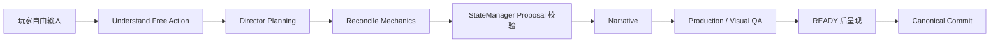

# Interaction：面向 Agent Skills 的互动短剧平台

## 项目概述

Interaction 是一个由多个 Agent Skills 协同驱动的互动短剧创作与游玩平台。它把“写故事、做角色、排练分支、生成镜头、让玩家行动”放进同一条可追踪的工作流：创作者可以用自然语言描述主题，系统先给出可编辑的理解结果，再由创作者确认世界、戏剧冲突、角色和机制；玩家进入故事后，每一回合都可以选择推荐行动，也可以直接输入自己的行动。系统会记录玩家意图、当前世界状态、角色关系、物品和线索，并在分支达到 READY 后才把它呈现给玩家。

项目的核心不是把一个超长 Prompt 接到网页上，而是把互动剧情拆成职责清晰、可组合、可观察的 Agent Skills。Understand Free Action 负责把自由输入整理为带来源的行动语义包；Evaluate Choices 负责结合当前剧情生成并排序推荐；Reconcile Mechanics 负责协调物品、线索、关系和限时机制；Narrative 负责把已批准的导演结果写成场景文本；Production 负责规划镜头和媒体任务；StateManager 是唯一的正式状态提交入口。每个 Skill 都有版本、输入输出契约、失败回退和调用轨迹，开发者模式可以查看“为什么触发、提出了什么、是否被接受、耗时多久”。

## 用户流程

1. **创建故事**：在 Standard UI 输入一句自然语言描述，查看 AI 理解和澄清问题，确认后写入结构化 World、Drama、Character 和 Mechanics。
2. **管理角色**：为角色建立身份参考组、造型、姿势、声音和版本；Scenario 发布时固定 Character Snapshot，避免全局角色后续编辑悄悄改变历史故事。
3. **发布前检查**：系统校验世界设定、戏剧参数、机制配置、角色快照和媒体引用。未通过检查的草稿不能伪装成已发布故事。
4. **开始游玩**：Opening 场景完成后，玩家在 Decision Lead 看到已锁定的推荐。推荐媒体是否 READY 与文字选项呈现分离，失败时可以重试、改写行动或切换为文字继续。
5. **行动产生后果**：玩家可以选择推荐，也可以输入“我去配电室寻找备用电源”这样的自由行动。系统保留原文和确认后的意图，再由导演、机制 Skills、叙事和制作管线共同推进下一幕。
6. **分支与世界延续**：选中的分支按 SELECTED → PROVISIONAL → CANONICAL 状态提交；失败分支会回滚，不污染正式世界。玩家可以在 Arc 结束后继续世界，新的 Session 仍从已发布版本开始。

## 一条行动如何穿过 Agent Skills

每个节点都写入可检索的 trace span。媒体生成失败只会让分支进入可恢复状态，不会跳过 READY 门槛或伪造 Canonical 结果。

## Agent Skills 的工程特点

- **有边界**：Skill 只读取契约允许的上下文，只提出 Proposal，不绕过 StateManager 直接修改世界。
- **可组合**：一次行动可以依次经过自由行动理解、机制协调、导演规划、叙事和视频制作，而不是由单一代理包办所有判断。
- **可版本化**：Skill manifest 记录版本、触发条件、依赖、失败语义和评估指标，轨迹中保存每次调用的输入摘要与结果。
- **可恢复**：Provider 超时、格式错误、媒体失败和重复提交都有显式状态与幂等保护；系统不会把错误页或假媒体当成成功。
- **可评估**：项目提供冻结轨迹、只读 Replay 和 Before/After 指标，可分析自由行动保真度、推荐差异性、机制触发质量、上下文规模和 Ready 延迟。

## 技术与创新亮点

平台采用 React + TypeScript 前端、FastAPI 异步后端和 PostgreSQL 持久化，统一由 Provider Router 管理本地模型与外部 API。DGX Spark 上运行 NVIDIA Nemotron 3.5 Lightning，为导演和制作规划提供低延迟本地推理；StepFun Step 3.7 Flash / Step 5 Preview 用于叙事、创作理解和回退；Jev 负责决策评估；图片使用 OpenAI-compatible Image Relay，视频使用 fal.ai 的 `minimax/h3-max/reference-to-video`。所有 Provider 都可以切换到 mock 模式进行无费用回归。

项目特别重视状态安全和证据链：分支有 READY 门槛，Canonical 状态采用两阶段提交，角色引用解析到不可变 Snapshot，所有媒体任务记录 Provider、模型、时长和重试；外部凭据只存在于服务端 Secret，不进入前端、Git 或轨迹。这样既能展示 Agent Skills 的协作过程，也能让评审复现一条从玩家输入到剧情结果的完整因果链。

## 运行结果与演示入口

仓库包含 Biohazard 互动短剧、Trajectory Mining、Skill Audit、只读 Replay 和浏览器验收证据。开发者可以在 Skill Observatory 查看调用链，也可以使用 mock 模式快速演示创建、发布、游玩和恢复流程。真实 Provider 的当前状态、媒体消费和已知限制以仓库中的验收报告为准，不把历史 Mock 或失败记录包装成真实成功。
