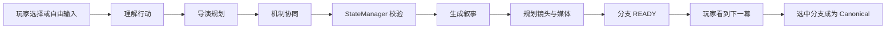

# 项目说明

## Interaction 是什么

Interaction 把故事创作、角色管理、互动游玩和媒体生成放在同一条工作流里。创作者可以从一句话开始，逐步确认世界、戏剧冲突、角色和机制；玩家进入已发布故事后，每回合都能选择系统给出的行动，也能直接说出自己的计划。

系统保存的不只是台词，还包括当前地点、世界事实、角色关系、库存、线索、角色已知信息和分支状态。下一幕只能建立在这些已确认事实之上。

## 谁使用它

**创作者**在 Story Creator 中创建故事，在 Character Studio 中维护角色身份和造型，完成检查后发布版本。

**玩家**在 Theater Player 中观看当前场景、做出选择、输入自由行动，并查看库存、线索和关系变化。

**开发者**在 Developer 面板查看 Provider 状态、分支生命周期和 Skill Chain，用于排查一次行动是怎样变成下一幕的。

## 一次行动的完整路径


```mermaid
flowchart LR
    A[玩家选择或自由输入] --> B[理解行动]
    B --> C[导演规划]
    C --> D[机制协同]
    D --> E[StateManager 校验]
    E --> F[生成叙事]
    F --> G[规划镜头与媒体]
    G --> H[分支 READY]
    H --> I[玩家看到下一幕]
    I --> J[选中分支成为 Canonical]
```

1. 前端提交玩家原文和当前会话版本。
2. Runtime 调用 Understand Free Action，把原文整理为行动、目标、策略和约束。
3. Director 根据当前场景和状态提出下一幕计划。
4. 机制 Skills 判断是否产生物品、线索、关系、愿望或限时事件 Proposal。
5. StateManager 校验并提交唯一的正式状态；Skill 不直接写世界。
6. Narrative 只把已批准的 Scene Packet 写成文本和字幕。
7. Production 生成镜头计划并提交媒体任务。分支达到 READY 后才会展示给玩家。
8. 玩家选择后，分支按 `SELECTED → PROVISIONAL → CANONICAL` 推进；失败分支不会污染正式状态。

## 关键设计

### 玩家行动优先

推荐行动是入口，不是边界。自由输入会保留原文、解释结果和最终影响，玩家可以说“我去配电室找备用电源”，即使这句话不在推荐列表中。

### 状态与文案分开

Director 和机制只提出结构化 Proposal，StateManager 负责校验、合并和提交。Narrative 不能凭空增加物品、知识或世界事实。

### 角色版本固定

发布故事时会创建 Character Snapshot。后续修改全局角色不会改变已经发布的故事和历史会话。

### Provider 可替换

Runtime 只依赖统一的 Provider 接口。可以使用 `mock` 离线运行，也可以分别接入文本模型、决策服务、图片中转和视频服务。

## 代码地图

```text
frontend/src/          React 页面、Creator、Character Studio、Theater Player
backend/app/api/       REST 和 WebSocket 接口
backend/app/runtime/   回合编排、分支生命周期、会话和语言设置
backend/app/domain/    Scenario、Character Snapshot、StateManager、数据契约
backend/app/providers/ Provider 实现与路由器
backend/app/skills/    Agent Skills、Proposal、触发策略
deploy/                PostgreSQL、应用和本地模型启动脚本
tools/                 回放、轨迹分析和验收工具
```

## Agent Skills

Interaction 的 Agent Skills 是有输入输出边界的能力模块，而不是一个包办一切的 Prompt。当前链路中的主要能力是：

- **Understand Free Action**：理解玩家自由行动，输出可追踪的行动语义包。
- **Evaluate Choices**：生成行动、风险和信息价值不同的推荐，并交给决策服务排序。
- **Reconcile Mechanics**：协调 Inventory、Clue、Relationship、Wish、Timed/QTE 的 Proposal。
- **Character Reference Resolver**：从发布快照中选择角色身份和参考素材。
- **Narrative**：把批准的 Scene Packet 写成场景文本和字幕。
- **Production / Visual QA**：规划镜头、绑定角色参考图并检查媒体结果。

每个 Skill 的调用、输入摘要、输出、耗时和 Proposal 结果都会进入轨迹，开发者可以按回合查看完整 Skill Chain。

## 演示路径

1. 用一句话创建一个故事，确认 AI 理解结果。
2. 为一个角色建立身份参考图和版本。
3. 发布故事并进入 Theater Player。
4. 先选择一条推荐，再输入一条不在推荐中的自由行动。
5. 在 Developer 面板查看行动理解、机制 Proposal、分支状态和媒体任务。
6. 在 `mock` 模式下演示失败恢复；接入真实 Provider 后再开启对应能力。
