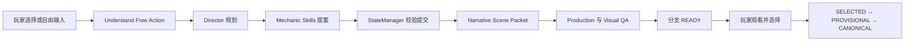

# PlotShift 项目说明

## 作品定位

PlotShift 是一个把“创作故事”和“游玩故事”放在同一条闭环里的 AI 互动短剧平台。传统互动视频通常只能在几个固定按钮中选择，生成式故事又常常因为模型自由发挥而失去连续性。PlotShift 同时解决这两个问题：玩家可以选择系统推荐的行动，也可以直接输入自己的计划；模型可以参与理解和写作，但世界事实、角色身份、物品、线索和分支状态由可校验的运行时保存。每一次行动都会留下可追踪的输入、判断、提案和提交结果，因此故事既有生成式的开放性，也有游戏状态的确定性。

创作者从一句自然语言想法开始，逐步确认世界规则、戏剧冲突、角色和玩法机制。发布时，角色会固定为版本化 Snapshot，场景、资产和规则组成可加载的 Scenario Version。玩家进入故事后，PlotShift 以回合为单位推进：先理解行动，再规划戏剧目标，判断库存、线索、关系、愿望或限时事件是否应该触发，生成下一幕叙事和镜头计划，最后在媒体准备完成后展示给玩家。玩家选择的分支才会从 `SELECTED` 进入 `PROVISIONAL`，通过媒体和状态校验后成为 `CANONICAL`；未选择或失败的推测分支不会污染正式世界。

## 核心亮点

### 1. 自由行动真正影响故事

推荐选项是帮助玩家开始行动的入口，不是剧情边界。玩家可以输入“我去配电室找备用电源”或提出完全不同的策略。系统保留玩家原文，并用行动语义包表达动作、目标、策略、约束、风险和信息需求，Director 再根据当前地点、压力和已知事实决定影响范围。这样可以在不牺牲世界规则的情况下保留玩家的 Agency。

### 2. Canonical State 与生成文案分离

模型和 Skills 只能提交结构化 Proposal，不能直接写数据库。StateManager 校验版本、权限、前置条件和幂等键后，原子提交 World State 与 Drama State。Narrative 只能使用批准的 Scene Packet，因此不会因为一句文案凭空增加物品、泄露秘密或复活已经离场的角色。

### 3. 版本化角色和可复用资产

角色身份、服装、标准视图和参考素材都有版本。发布故事时生成 Character Snapshot，后续修改全局角色不会改变已发布故事或历史会话。Production 依据 Snapshot 绑定参考图，再调用视频 Provider，从源头减少同一角色在不同镜头中变成另一个人的问题。

### 4. Agent Skills 可观察、可组合

PlotShift 不是一个包办一切的 Prompt。Understand Free Action、Evaluate Choices、Reconcile Mechanics、Character Reference Resolver、Narrative、Production 和 Visual QA 都有自己的输入输出、失败路径和 trace。开发者可以看到某一回合触发了哪些 Skill、产生了什么提案、哪些提案被 StateManager 接受，以及每一步耗时多少。

### 5. 本地与云端按职责组合

高影响的 Director 规划可以在本地 NVIDIA GPU 上运行 Nemotron，低频高质量的创作和审查使用 StepFun，图片走 OpenAI-compatible Image Relay，视频既可以走 fal.ai 的 `minimax/h3-max/reference-to-video`，也可以切换到本地 Sol-H3/h3-adapter。两条视频路径共享同一个任务、分支和 SceneArtifact 契约：Fal 负责云端队列和付费生成，Sol-H3 负责本机 ComfyUI-H3/Sol 工作流。Provider Router 统一超时、重试、熔断、回退和用量记录，使模型替换不会扩散到业务代码。没有 GPU 时仍可使用 mock 或纯云端模式。

## 一回合如何运行


```mermaid
flowchart LR
    A[玩家选择或自由输入] --> B[Understand Free Action]
    B --> C[Director 规划]
    C --> D[Mechanic Skills 提案]
    D --> E[StateManager 校验提交]
    E --> F[Narrative Scene Packet]
    F --> G[Production 与 Visual QA]
    G --> H[分支 READY]
    H --> I[玩家观看并选择]
    I --> J[SELECTED → PROVISIONAL → CANONICAL]
```

1. 前端提交玩家原文、会话版本和当前分支。
2. Runtime 生成行动语义包；低影响的小动作可快速确认，高影响行动进入完整规划。
3. Director 读取分层 Context，输出戏剧指令、短期目标和候选分支约束。
4. 机制协同层判断 Inventory、Clue、Relationship、Wish、Timed/QTE 等能力，并返回 Proposal。
5. StateManager 以版本和幂等键校验提案，提交唯一的 Canonical State。
6. Narrative 只接收允许揭示的 Scene Packet，生成场景文本、字幕和玩家可见事实。
7. Production 绑定角色 Snapshot、镜头、参考素材和 Provider，分支全部达到 READY 后才公布。
8. 玩家选择后才推进正式分支；失败时回滚 provisional 状态或发布仍然 READY 的较小 K 集合。

## 架构与优化思路

PlotShift 采用前端、API、Runtime、Skills、StateManager、Provider Router 和持久化层的分层架构。前端负责创作器、角色工作室、剧场播放器和开发者观察面板；FastAPI 提供 REST/WebSocket；Runtime 编排回合和分支生命周期；StateManager 保证提交边界；PostgreSQL 保存故事版本、快照、会话、轨迹和用量。

性能优化遵循“先决定是否值得生成，再生成媒体”的原则。Jev 负责快速离散判断和推荐排序，Director 只对需要完整戏剧推进的行动规划；分层 Context 只把当前场景相关事实交给对应 Skill，避免每回合重复发送完整世界日志；候选分支在锁定 K 后并行准备，视频只对玩家实际选择或明确测试的分支付费生成。Provider Router 使用连接复用、超时、有限重试和熔断，Runtime 使用队列并发上限保护本地模型。轨迹记录各阶段延迟、上下文规模、Token、媒体任务和失败原因，可用 Replay 在不重新生成视频的情况下比较新旧策略。

## 代码入口

```text
frontend/src/          React、TypeScript、Vite 页面和播放器
backend/app/api/       REST 与 WebSocket
backend/app/runtime/   回合编排、分支、会话和语言设置
backend/app/domain/    Scenario、Snapshot、StateManager、契约
backend/app/providers/ Provider 实现、路由、回退和熔断
backend/app/skills/    Agent Skills、Proposal 和注册表
deploy/                PostgreSQL、应用和 Nemotron 启动脚本
tools/                 轨迹挖掘、Replay 和验收工具
```
