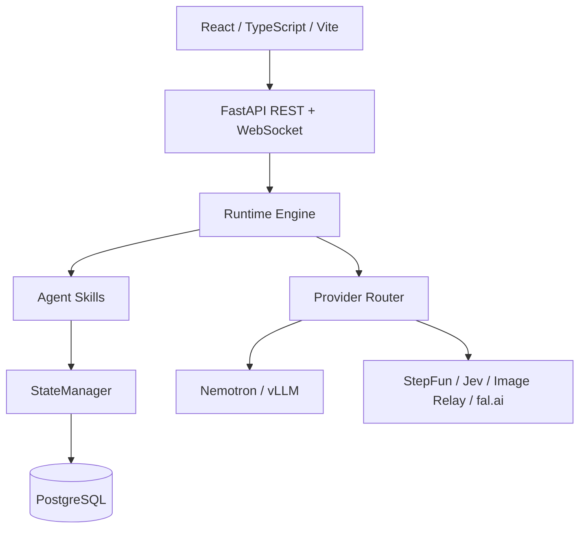

# 技术栈说明

## 架构分层

前端负责交互和状态呈现，Runtime 负责编排，Skills 负责需要判断的能力，StateManager 负责确定性提交，Provider Router 负责外部服务适配。这样替换模型或供应商时，不需要修改玩家流程和 Canonical 状态规则。

## 总览

| 层级 | 技术 | 在项目中的职责 |
| --- | --- | --- |
| 前端 | React 18、TypeScript、Vite | Story Library、Creator、Character Studio、Theater Player、Developer Inspector |
| 后端 API | Python、FastAPI、Uvicorn | REST/WebSocket、会话、创作、游玩和开发者接口 |
| 数据访问 | SQLAlchemy 2 async、Pydantic v2、Alembic | 异步 ORM、契约校验、迁移与持久化模型 |
| 数据库 | PostgreSQL 16 | Scenario、Character Snapshot、Session、Branch、Provider Trace、Usage Ledger |
| 离线测试 | SQLite、aiosqlite、pytest、Playwright | 隔离回归、浏览器验收、Replay 与无费用测试 |
| 媒体处理 | FFmpeg、aiofiles、multipart 上传 | Mock 占位视频、镜头拼接、参考素材和生成结果管理 |
| 部署 | Docker Compose、systemd/容器 restart policy | PostgreSQL、后端、模型服务的持久运行 |

## NVIDIA 与本地模型

| 项目 | 版本/模型 | 用途 |
| --- | --- | --- |
| 硬件 | NVIDIA DGX Spark | 本地推理和开发部署目标 |
| NVIDIA 软件栈 | NVIDIA 驱动/CUDA 运行时；vLLM OpenAI 镜像 `v0.27.1-aarch64` | 在 ARM64 DGX Spark 上托管本地模型 |
| NVIDIA 模型 | `nvidia/NVIDIA-Nemotron-3.5-Lightning-30B-A3B-NVFP4` | Director 主模型、Production 规划和本地文本回退 |
| 推理优化 | Marlin、FlashInfer、FP8 KV cache、prefix caching | 降低显存占用并提升本地推理吞吐 |
| NVIDIA SDK 说明 | 应用层通过 vLLM OpenAI-compatible API 访问模型 | 当前仓库没有把 NVIDIA 私有 SDK 或密钥硬编码进业务代码；若部署环境提供 NeMo/NVIDIA Agent Toolkit，可在服务边界替换为兼容 API |

模型启动脚本会校验 52 个权重分片、模型索引和服务端 `/v1/models`；因此“容器启动”与“模型已加载”在验收中是两个独立条件。

## StepFun 模型

| 模型 | 路由 | 用途 |
| --- | --- | --- |
| `step-3.7-flash` | `narrative` 优先 | 根据已批准 ScenePacket 生成中文叙事和字幕文本 |
| `step-5-preview` | `authoring`、Director fallback、Critic | 创作理解、澄清、结构化建议、格式修复和离线评估 |

StepFun 使用 OpenAI-compatible endpoint。Key 只在后端环境中读取，前端不会获得该凭据。

## 其他 Provider

| Provider | 模型/接口 | 用途 | 费用控制 |
| --- | --- | --- | --- |
| Jev | `jev-latest` | 推荐候选评估、排序、置信度和澄清信号 | 可关闭真实模式并使用 mock decision |
| 图片中转 | `gpt-image-2.5-sunburst` 及 fallback | Character Candidate、标准视图和 Outfit 图片 | 通过 `IMAGE_PROVIDER_*` 配置；不走 fal.ai 图片模型 |
| fal.ai | `minimax/h3-max/reference-to-video` | 参考图到视频的真实 H3 生成 | `FAL_PAID_GENERATION_ENABLED` 总开关；Jev 预生成默认关闭 |
| Sol-H3 | 本地 adapter | VIDEO_LOCAL profile 的视频实验 | 不访问 fal.ai；由本地进程和 profile 健康检查管理 |
| Mock Providers | 确定性文本、决策、FFmpeg 视频 | 离线开发、单元测试、浏览器回归 | 零外部请求，不计入真实 Provider 证据 |

## Agent Skills 与状态安全

平台 Skills 位于 `backend/app/skills/`，由 Runtime Router 按场景和行动触发。当前主要能力包括：

- **Understand Free Action v2**：把玩家原文、Jev observation 和确认编辑整理成 `ActionSemanticPacket`。
- **Evaluate Choices v1**：基于当前 beat、状态投影和玩家偏好生成候选、去除精确重复并交给 Jev 排序。
- **Reconcile Mechanics v1**：协调 Inventory、Clue、Relationship、Wish、Timed/QTE 的 Proposal。
- **Character Reference Resolver**：从已发布 Snapshot 选择角色身份与参考素材。
- **Production / Visual QA**：规划镜头、参考图和媒体检查；不直接提交 Canonical 状态。

所有 Skill 只能提出经过 schema 校验的 Proposal；StateManager 才能提交 World、Drama、Inventory、Relationship、Knowledge 和 Branch 状态。轨迹系统记录 Skill 版本、输入摘要、输出、拒绝原因、耗时和回退路径，便于 Replay 与比赛现场展示。

## Skill 标准契约

每个正式 Skill 至少定义以下字段：

| 字段 | 含义 |
| --- | --- |
| `name` / `version` | 人类可读名称和可回放版本 |
| `when_to_use` | 触发条件与不触发边界 |
| `input` | 允许读取的最小上下文 |
| `output` | 结构化结果或 State Proposal |
| `side_effects` | 是否只读、是否产生媒体任务、是否允许 Proposal |
| `failure` / `fallback` | 超时、格式错误和 Provider 不可用时的行为 |
| `metrics` | 延迟、调用数、接受率、回退次数和质量指标 |

这套契约让评审可以从 Developer Inspector 看到 Skill Chain，而不必阅读一个巨大 Prompt 才能理解系统。

## Provider 路由矩阵

| 能力 | 首选 | 回退 | 是否默认产生费用 |
| --- | --- | --- | --- |
| Director | Nemotron 本地 | Step 5 / mock | 否（本地）或按 StepFun 账户计费 |
| Narrative | Step 3.7 | Nemotron / mock | 取决于配置 |
| Authoring | Step 5 | mock | 取决于配置 |
| Decision | Jev | mock decision | 取决于配置 |
| Image | OpenAI-compatible Relay | 配置的 fallback model | 是，按中转服务计费 |
| Cloud Video | fal H3 Max | mock video（hybrid） | 是，由付费开关保护 |
| Local Video | Sol-H3 adapter | mock video | 由本地 GPU 和服务配置决定 |

Router 会记录 selected、skipped 和 fallback 原因；业务代码不直接拼接 Provider 请求，也不在前端保存密钥。

## 质量与工程验证

测试分为四层：

1. **契约测试**：验证 Provider 请求、Schema、Proposal 和状态转换。
2. **Runtime 测试**：验证 READY、两阶段 Canonical、幂等重试和媒体失败恢复。
3. **浏览器测试**：验证 Creator、Character Studio、Theater Player 和 Developer Inspector。
4. **Replay / Smoke**：使用历史输入或固定夹具比较自由行动保真度、选项差异、机制触发和上下文效率；Production 只做 plan-only，不自动提交 H3。

提交前至少执行后端 pytest、前端 `npm run build` 和 mock 健康检查；真实 Provider 验证应单独记录模型、请求数、费用开关和失败原因。

## 许可证与密钥边界

本仓库代码和文档不包含 StepFun、Jev、fal.ai、图片中转或本地 adapter 的真实密钥。部署者应遵守各 Provider 的服务条款与模型许可证，并在自己的 Secret 管理系统中配置凭据。模型名称、端点和开关写入 `.env.example` 只是接入说明，不代表仓库提供这些服务或承担其费用。
