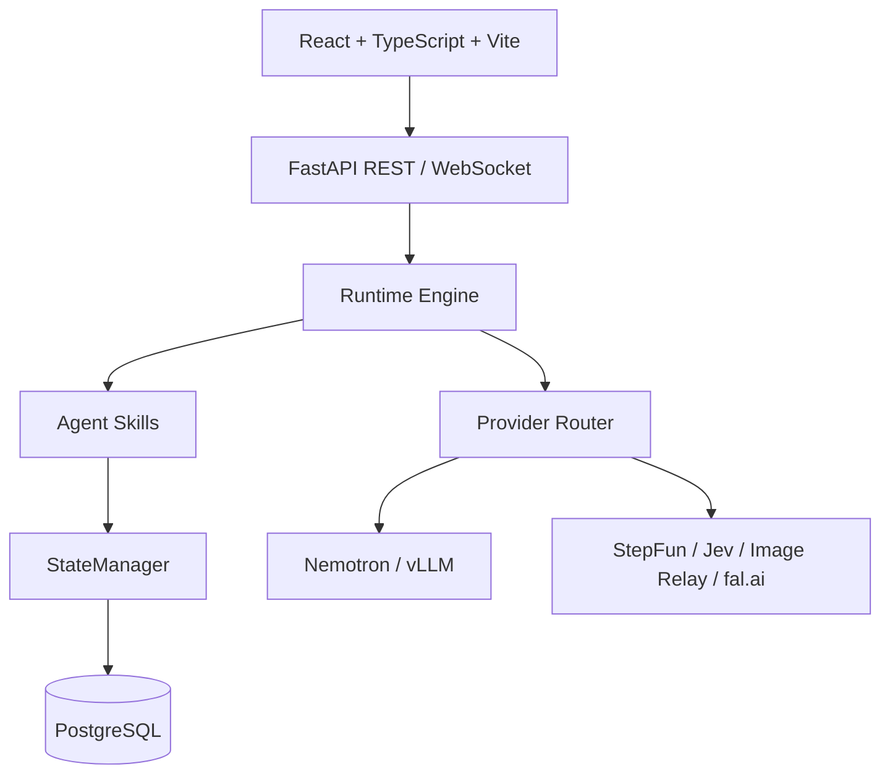

# 技术栈说明

## 总体结构


```mermaid
flowchart TB
    UI[React + TypeScript + Vite]
    API[FastAPI REST / WebSocket]
    RT[Runtime Engine]
    SK[Agent Skills]
    SM[StateManager]
    DB[(PostgreSQL)]
    PR[Provider Router]
    LOCAL[Nemotron / vLLM]
    CLOUD[StepFun / Jev / Image Relay / fal.ai]
    UI --> API --> RT
    RT --> SK
    SK --> SM --> DB
    RT --> PR
    PR --> LOCAL
    PR --> CLOUD
```

前端负责页面和播放器，Runtime 编排一回合，Skills 做需要判断的工作，StateManager 提交正式状态，Provider Router 屏蔽不同模型和服务的请求差异。

## 组件清单

| 层 | 技术 | 负责什么 |
| --- | --- | --- |
| 前端 | React 18、TypeScript、Vite | Story Library、Creator、Character Studio、Theater Player、Developer 面板 |
| API | Python、FastAPI、Uvicorn | REST、WebSocket、创作、会话和开发者接口 |
| 数据 | SQLAlchemy 2 async、Pydantic 2、Alembic | 数据模型、契约校验、迁移 |
| 数据库 | PostgreSQL 16 | 故事版本、角色快照、会话、分支、Provider Trace、Usage Ledger |
| 媒体 | FFmpeg、aiofiles、multipart | Mock 视频、素材存储、媒体归档 |
| 测试 | pytest、SQLite/aiosqlite、Playwright | 后端回归、隔离运行、浏览器流程 |
| 部署 | Docker Compose、systemd 或容器重启策略 | 数据库、应用和模型服务的长期运行 |

## Provider 路由

| 能力 | 默认 Provider | 作用 |
| --- | --- | --- |
| Director | Nemotron Lightning（本地） | 规划下一幕、整理分支目标 |
| Narrative | Step 3.7 Flash | 把 Scene Packet 写成叙事和字幕 |
| Authoring | Step 5 Preview | 故事理解、澄清和结构化创作 |
| Decision | Jev | 评估和排序推荐行动 |
| Image | OpenAI-compatible Image Relay | 角色图、标准视图、编辑图 |
| Cloud Video | fal.ai `minimax/h3-max/reference-to-video` | 参考图到视频 |
| Local Video | Sol-H3 adapter | 本地视频实验 |
| Offline | Mock Providers | 无外部请求的开发和测试 |

Provider Router 根据 `PROVIDER_MODE` 和 `RUNTIME_PROFILE` 选择服务，并记录 selected、fallback 和失败原因。业务代码不直接拼接第三方请求。

## Agent Skills 和状态边界

Skill 位于 `backend/app/skills/`，由 Runtime 按回合触发。它们都有明确的输入、输出和失败路径：

- **Understand Free Action**：输出行动、目标、策略和约束。
- **Evaluate Choices**：生成并筛选行动差异、风险和信息价值不同的推荐。
- **Reconcile Mechanics**：协调库存、线索、关系、愿望和限时机制。
- **Character Reference Resolver**：解析发布角色快照和参考素材。
- **Narrative**：只处理已批准的 Scene Packet。
- **Production / Visual QA**：规划镜头，绑定参考图，检查媒体结果。

Skill 只返回结构化 Proposal；StateManager 是唯一的 Canonical 提交入口。分支必须达到 READY 才能显示，选中后才会进入 Canonical。

## 代码目录

```text
backend/app/api/        HTTP 和 WebSocket 路由
backend/app/runtime/    RuntimeEngine、会话、分支和语言设置
backend/app/domain/     StateManager、Scenario、Character Snapshot、契约
backend/app/providers/  Provider 实现、路由和熔断
backend/app/skills/     Skill 实现和注册表
frontend/src/            页面、播放器和开发者面板
deploy/                 PostgreSQL、应用和 Nemotron 启动脚本
tools/                  轨迹回放、分析和媒体检查
```

## 数据流和持久化

一回合至少产生以下记录：玩家原文、行动语义包、导演计划、机制 Proposal、State Patch、Narrative 输出、生产计划、媒体任务、分支状态和最终 Canonical 状态。Provider Trace 保存模型、耗时、状态和重试次数；媒体文件存放在 `backend/data/` 下。

角色使用版本和 Snapshot：发布时固定角色资产，后续编辑生成新版本。历史会话读取自己的 Snapshot，因此可以稳定回放。

## 本地模型

DGX Spark 上通过 vLLM OpenAI-compatible API 托管 `nvidia/NVIDIA-Nemotron-3.5-Lightning-30B-A3B-NVFP4`。启动脚本检查模型权重分片和 `/v1/models`。后端把它当作普通 OpenAI-compatible Provider，因此也可以替换成其他兼容服务。

## 测试层次

1. Provider 和数据契约测试：请求格式、Schema 和状态转换。
2. Runtime 测试：READY、分支提交、幂等重试和媒体失败恢复。
3. 浏览器测试：Creator、角色管理、播放器和开发者面板。
4. Replay：使用固定历史输入比较行动保真度、选项差异、机制触发和上下文规模；生产阶段只做 plan-only。

常用命令见[部署说明](DEPLOYMENT_GUIDE.md)的“离线回归”。
