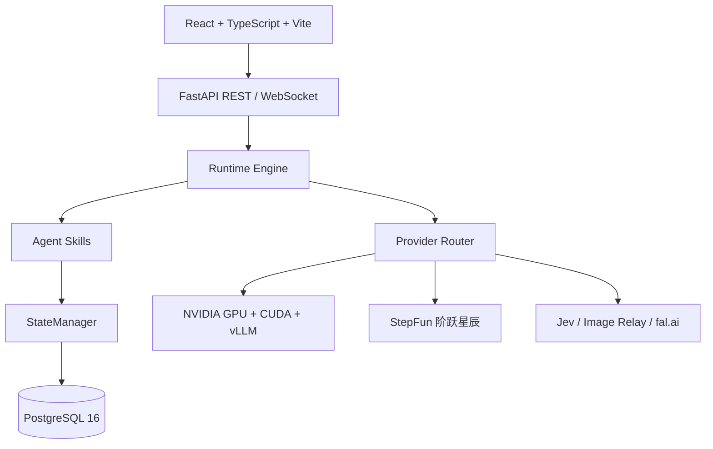

# PlotShift 技术栈说明

## 总体架构


```mermaid
flowchart TB
    UI[React + TypeScript + Vite]
    API[FastAPI REST / WebSocket]
    RT[Runtime Engine]
    SK[Agent Skills]
    SM[StateManager]
    DB[(PostgreSQL 16)]
    PR[Provider Router]
    NVIDIA[NVIDIA GPU + CUDA + vLLM]
    STEP[StepFun 阶跃星辰]
    CLOUD[Jev / Image Relay / fal.ai]
    UI --> API --> RT
    RT --> SK --> SM --> DB
    RT --> PR
    PR --> NVIDIA
    PR --> STEP
    PR --> CLOUD
```

PlotShift 的核心原则是“Runtime 负责编排，Skill 负责判断，StateManager 负责提交，Provider Router 负责外部服务”。业务代码不直接绑定第三方 SDK；每个 Provider 都返回统一契约、来源、耗时、重试和失败信息。

## 应用层

| 层 | 技术 | 用途 |
| --- | --- | --- |
| 前端 | React 18、TypeScript、Vite 6 | Story Library、Creator、Character Studio、Theater Player、Developer 面板 |
| API | Python 3.11、FastAPI、Uvicorn、HTTPX | REST、WebSocket、会话、创作、媒体和开发者接口 |
| 数据契约 | Pydantic 2、SQLAlchemy 2 async、Alembic | 请求响应 Schema、状态提案、迁移和版本校验 |
| 数据库 | PostgreSQL 16；测试使用 SQLite/aiosqlite | Scenario、角色 Snapshot、Session、Branch、Trace、Usage Ledger |
| 媒体 | FFmpeg、aiofiles、multipart | 媒体归档、Mock 视频、上传和输出检查 |
| 测试 | pytest、pytest-asyncio、Playwright、Vite build | 后端回归、隔离运行、浏览器流程和前端构建 |
| 部署 | Docker Compose、systemd 或 `restart: unless-stopped` | 数据库、应用和本地模型的长期运行 |

## NVIDIA 与本地算力

本项目实际使用的 NVIDIA SDK/运行组件是 CUDA Toolkit（及兼容的 CUDA Runtime）、NVIDIA Container Toolkit、vLLM、FlashInfer 和 Marlin；NIM、TensorRT 等没有在当前部署中作为必需依赖声明。

项目使用的 NVIDIA 相关组件如下：

| 组件 | 用途 |
| --- | --- |
| NVIDIA Driver | 让宿主机识别 GPU，并提供兼容的 CUDA 驱动接口 |
| CUDA Runtime / CUDA Toolkit | GPU 内核、显存和算子运行环境 |
| NVIDIA Container Toolkit | 把 GPU、驱动和 CUDA 能力安全注入 Docker 容器 |
| NVIDIA DGX Spark | 当前本地部署的统一内存 NVIDIA 计算平台 |
| vLLM OpenAI-compatible server | 托管本地 Nemotron，并提供统一 `/v1` API |
| FlashInfer | Nemotron Mamba 路径和高效推理内核 |
| Marlin | MoE/NVFP4 权重的高效推理后端 |
| FP8 KV cache、prefix caching | 降低 KV 显存占用，复用重复的系统上下文 |

本地 Director 模型是 **`nvidia/NVIDIA-Nemotron-3.5-Lightning-30B-A3B-NVFP4`**。启动脚本检查完整权重索引和 52 个分片，通过 `--served-model-name` 暴露为 OpenAI-compatible 模型。Runtime 使用并发上限、队列超时和请求超时，避免 GPU 被突发的多分支请求耗尽。

## StepFun 阶跃星辰模型

PlotShift 使用 StepFun 的两个模型 ID：

| 模型 | 角色 |
| --- | --- |
| **`step-3.7-flash`** | Narrative 主模型，把批准的 Scene Packet 写成场景文本、字幕和玩家可见结果 |
| **`step-5-preview`** | Authoring、澄清、结构化创作、审查和 Director 的质量回退 |

StepFun 通过 `STEP_BASE_URL` 和服务端 `STEP_API_KEY` 接入。应用只在后端调用，前端不接触 Key。

## 其他 Provider

| 能力 | Provider / 模型 | 说明 |
| --- | --- | --- |
| 决策与排序 | Jev / TypeSafe SystemOne，`jev-latest` | 快速分类、路由、置信和 Top-K 排序；不拥有世界真相 |
| 图片生成与编辑 | OpenAI-compatible Image Relay，主模型 `gpt-image-2.5-sunburst` | 角色图、标准视图、编辑图；图片不走 fal.ai |
| 云端视频 | fal.ai `minimax/h3-max/reference-to-video` | 参考图到视频；仅在开关允许且发生真实测试/玩家选择时付费 |
| 本地视频实验 | Sol-H3 adapter | `VIDEO_LOCAL_PROFILE` 下使用，和 Nemotron 通过显式 Profile 切换 |
| 离线开发 | Mock Providers | 不发外部请求，验证状态机、失败恢复和 UI |

Provider Router 集中处理 health check、timeout、retry、fallback、circuit breaker、成本和 trace。`AGENT_LOCAL_PROFILE` 负责本地 Nemotron；`VIDEO_LOCAL_PROFILE` 负责本地视频实验。两种 Profile 的切换会先 drain、保存状态、卸载旧服务、健康检查新服务，再更新路由。

### 两条 H3 视频路径的边界

**Minimax H3 / fal.ai** 是云端付费路径。PlotShift 向 `https://queue.fal.run/minimax/h3-max/reference-to-video` 提交每个 Shot，保存 Fal 返回的队列 URL，轮询到完成后下载 MP4。请求包含整数秒数、480P/768P/1080P 分辨率、16:9 等宽高比，以及最多 9 张图片、3 个视频、3 个音频的参考素材限制。`FAL_PAID_GENERATION_ENABLED` 只控制这条云端付费路径；它不应该阻止 Image Relay 生图，也不代表 Sol-H3 是否可用。

Fal.ai 这条远端路径的主要限制是延迟：实际调用 `minimax/h3-max/reference-to-video` 时，单个视频通常约 60 秒才能完成，拥堵时可能更长。它适合低频真实生成和最终人工验收，不适合开发阶段连续点击或为推荐选项预生成视频。需要较短反馈周期时，应优先使用下面的 Sol-H3 本地部署路径。

**Sol-H3** 是本地适配器路径。PlotShift 不直接执行 ComfyUI 节点，而是调用 `SOL_H3_BASE_URL` 提供的 h3-adapter：

```text
POST /v1/videos/generations
  → {request_id, status}
GET  /v1/videos/{id}
  → pending | running | done | failed | expired | cancelled
GET  /v1/videos/{id}/content
  → MP4（可选内容端点）
POST /v1/videos/{id}/cancel
  → 取消任务
```

适配器后面可以连接 ComfyUI-H3/Sol 工作流和本地 NVIDIA GPU。模型权重、节点包和采样参数不在本仓库内，因此本项目只固定 REST 适配契约、参考素材映射、任务状态和本地文件归档。`VIDEO_LOCAL_PROFILE` 下 Router 选择 `sol_h3_local`；`AGENT_LOCAL_PROFILE` 下 Router 选择 `h3_max` 作为云端视频 Provider。两者通过同一个 Branch/SceneArtifact 契约进入 Runtime，媒体 Provider 可以替换而不改变 Canonical State。

### 视频配置字段

| 环境变量 | Minimax/Fal | Sol-H3 本地 |
| --- | --- | --- |
| `FAL_H3_MODEL` | `minimax/h3-max/reference-to-video` | 不使用 |
| `FAL_KEY` / `FAL_KEY_SECONDARY` | Fal 队列鉴权 | 不使用 |
| `FAL_PAID_GENERATION_ENABLED` | 云端付费总开关 | 不影响 |
| `SOL_H3_BASE_URL` | 不使用 | 例如 `http://127.0.0.1:8790` |
| `SOL_H3_API_KEY` | 不使用 | 可选适配器 Bearer Token |
| `RUNTIME_PROFILE` | `AGENT_LOCAL_PROFILE` | `VIDEO_LOCAL_PROFILE` |
| `VIDEO_GENERATION_RESOLUTION` | 480P/768P/1080P | 480P/768P/1080P |

## Agent Skills

Skills 位于 `backend/app/skills/`，由 Runtime 根据行动和上下文触发。它们不是普通工具函数，而是具有稳定输入输出和可评估结果的能力：

- **Understand Free Action**：`raw_input + context → ActionSemanticPacket`。
- **Evaluate Choices**：`scene + goals + constraints → diverse candidates`。
- **Reconcile Mechanics**：`action + state → typed mechanic proposals`。
- **Character Reference Resolver**：`character snapshot + shot → reference bindings`。
- **Narrative**：`approved ScenePacket → text/caption/player output`。
- **Production / Visual QA**：`directive + refs → shot plan/media result/continuity verdict`。

Skill 只能读授权 Context 和返回 Proposal；Canonical 状态只由 StateManager 写入。每次调用记录 Skill 版本、触发原因、输入摘要、输出、Proposal 接受率、耗时、Token 和 fallback 次数，支持 Developer Skill Chain 和历史 Replay。

## 数据与可观测性

每个回合保存玩家原文、行动语义、Jev 结果、Director 指令、Skill 提案、State Patch、Narrative、Production、媒体任务、Branch 生命周期和 Canonical State。角色通过发布版本和 Scenario Snapshot 固定；历史会话不会被全局角色编辑静默改变。Provider Trace 与 Usage Ledger 用于定位慢请求、重复请求、付费媒体和恢复路径。

## 目录索引

```text
frontend/src/          页面、播放器、主题和设置
backend/app/api/       HTTP/WebSocket 路由
backend/app/runtime/   RuntimeEngine、Session、Branch、语言设置
backend/app/domain/    StateManager、Scenario、Snapshot、契约
backend/app/providers/ Provider、Router、Fallback、Circuit Breaker
backend/app/skills/    Skill 实现、策略和注册表
deploy/                PostgreSQL、应用和 Nemotron 启动脚本
tools/                 Trajectory Mining、Replay、并发和验收工具
```
